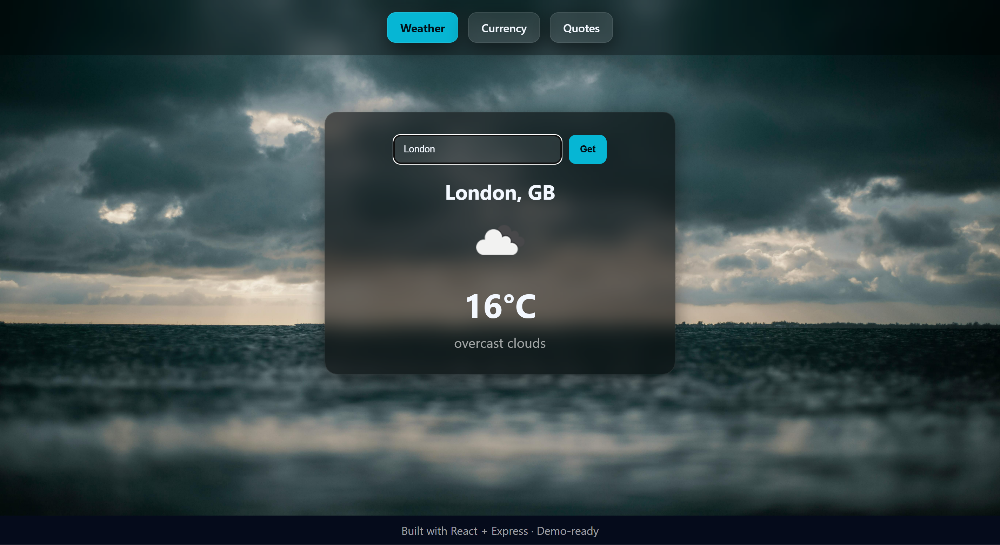

# 🌦️ InfoHub – Weather, Currency & Quotes App

A full-stack web application built using **React (Vite)** for the client and **Node.js + Express** for the server.  
It integrates with **OpenWeatherMap API** and **ExchangeRate API** to display live weather and currency conversion data, along with motivational quotes.

---

## 📁 Project Structure
```bash

InfoHub-Challenge/
├── client/                      (Your React Frontend)
│   ├── public/
│   ├── src/
│   │   ├── components/
│   │   │   ├── WeatherModule.jsx      (Handles Weather UI and fetch)
│   │   │   ├── CurrencyConverter.jsx  (Handles Converter UI and fetch)
│   │   │   └── QuoteGenerator.jsx     (Handles Quotes UI and fetch)
│   │   ├── App.jsx                    (Main application, handles tabs/navigation)
│   │   ├── index.css
│   │   └── main.jsx                   (App entry point)
│   └── package.json
│
└── server/                      (Your Node.js/Express Backend)
    ├── node_modules/
    ├── .env                     (API Keys go here!)
    ├── server.js                (Main Express server logic)
    └── package.json

```

---

## 🚀 Features

### 🌤 Weather Info
- Fetches real-time weather data from **OpenWeatherMap API**.
- Displays city, temperature (°C), country, condition, and icon.

### 💱 Currency Converter
- Converts INR to **USD** and **EUR** using **ExchangeRate API**.
- Input amount dynamically updates converted values.

### 💬 Random Quote Generator
- Shows motivational quotes from a local array.
- New quote fetched on button click.

### 🧠 Tech Stack
- **Frontend:** React (Vite), Axios, CSS3 (modern glassmorphism design)
- **Backend:** Node.js, Express, Axios, dotenv, CORS
- **APIs:** OpenWeatherMap, ExchangeRate (open.er-api.com)

---

## ⚙️ Setup Instructions

### 🔹 Prerequisites
Make sure you have installed:
- [Node.js](https://nodejs.org/) (v16+ recommended)
- npm or yarn
- OpenWeatherMap API key → [Get one here](https://openweathermap.org/api)

---

## 🖥 Backend Setup (Server)
1. Navigate to the server folder:
 ```bash
cd server
 ```

## Install dependencies:
```bash
npm install
```

 ## Create a .env file in the server directory:
```bash
OPENWEATHER_API_KEY=your_api_key_here
PORT=3001
```


## Start the server:

```bash
npm run dev
```


The server will start at http://localhost:3001


| Endpoint                   | Method | Description                            |
| -------------------------- | ------ | -------------------------------------- |
| `/api/weather?city=London` | GET    | Returns weather details for given city |
| `/api/currency?amount=100` | GET    | Converts INR to USD & EUR              |
| `/api/quote`               | GET    | Returns a random motivational quote    |
| `/api/health`              | GET    | Health check endpoint                  |

```bash
{
  "success": true,
  "weather": {
    "city": "London",
    "country": "GB",
    "temperatureC": 15.4,
    "condition": "light rain",
    "icon": "https://openweathermap.org/img/wn/10d@2x.png"
  }
}
```
---
## Frontend Setup (Client)

## Navigate to the client folder:
```bash
cd client
```

## Install dependencies:
```bash
npm install
```

## Start the Vite development server:
```bash
npm run dev
```

Open your browser and go to the printed local URL (e.g. http://localhost:5173
).

The frontend automatically connects to the backend (http://localhost:3001
).


| Key                   | Description                | Example     |
| --------------------- | -------------------------- | ----------- |
| `OPENWEATHER_API_KEY` | API key for OpenWeatherMap | `abc123xyz` |
| `PORT`                | Backend server port        | `3001`      |


---

## 🖼️ Preview

### Weather Page


### Currency Converter


### Quote Generator


---

